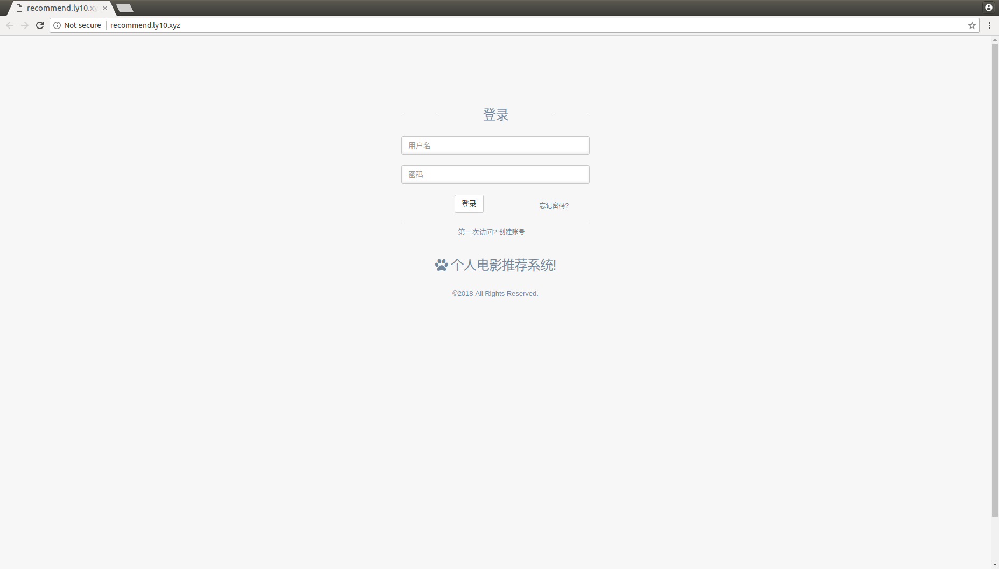
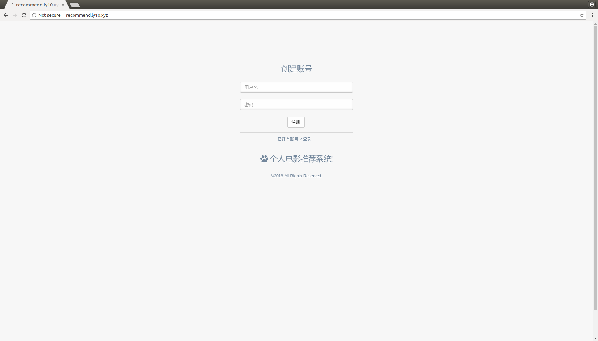
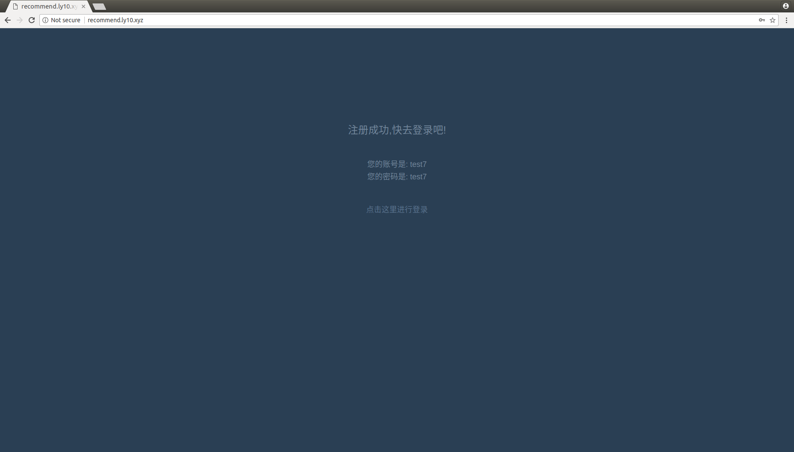
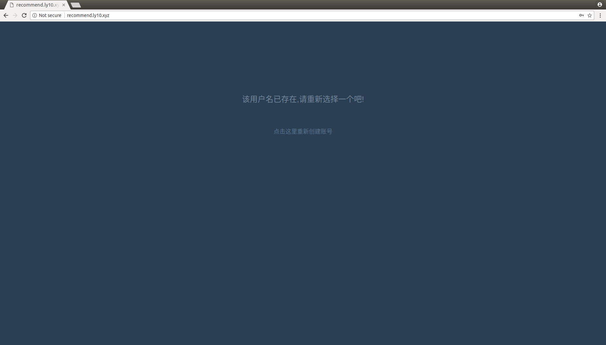
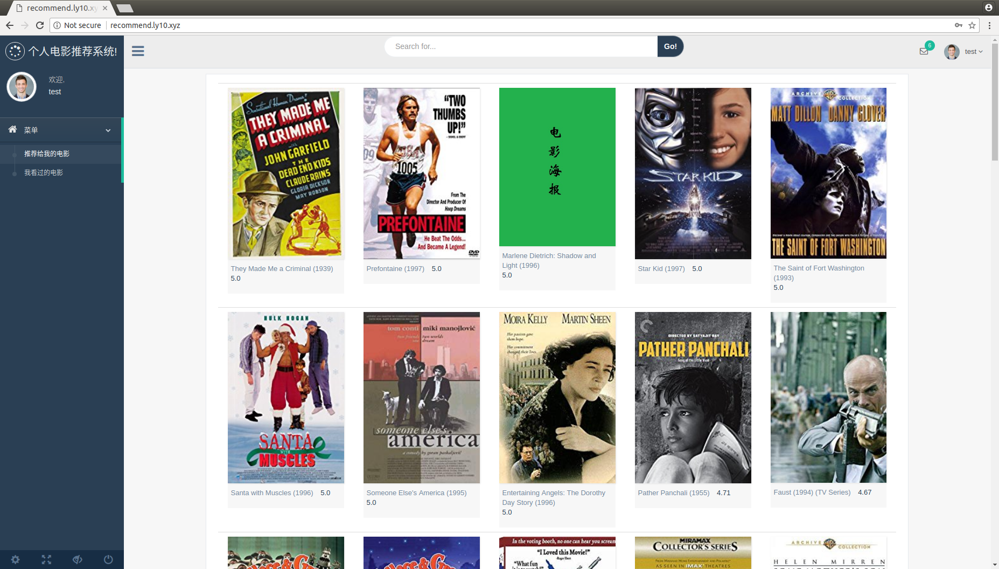
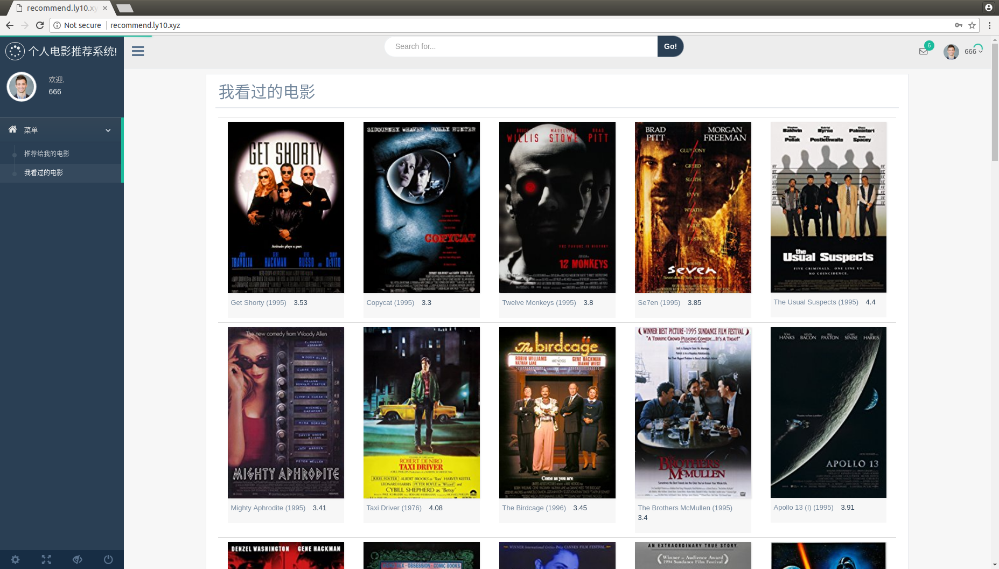
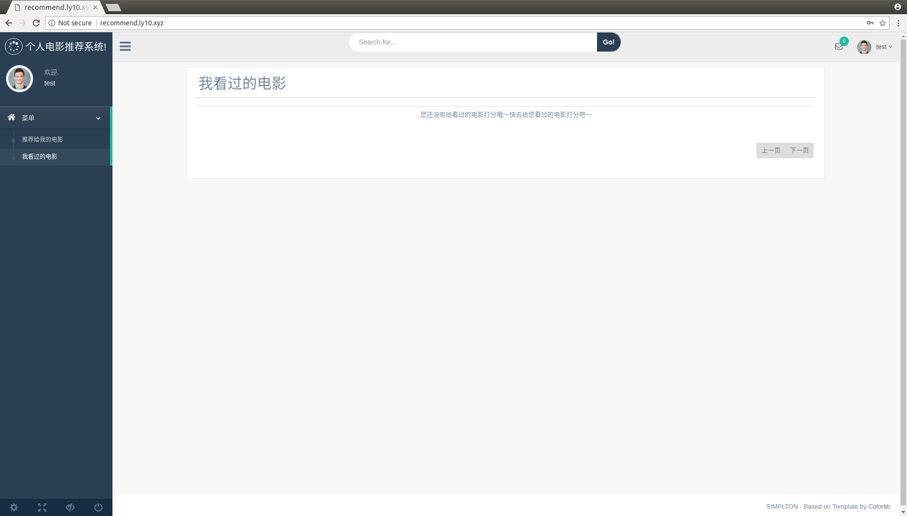
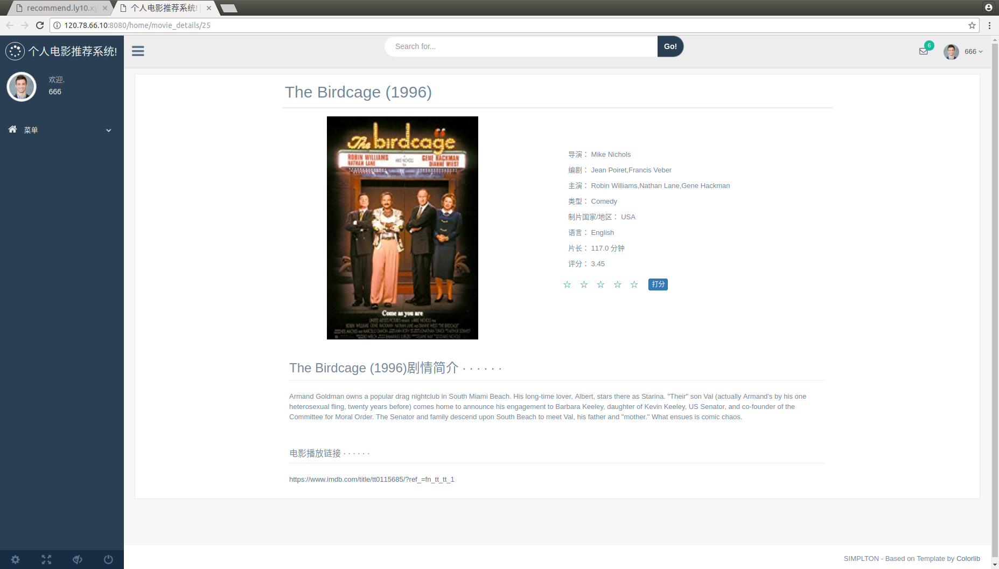
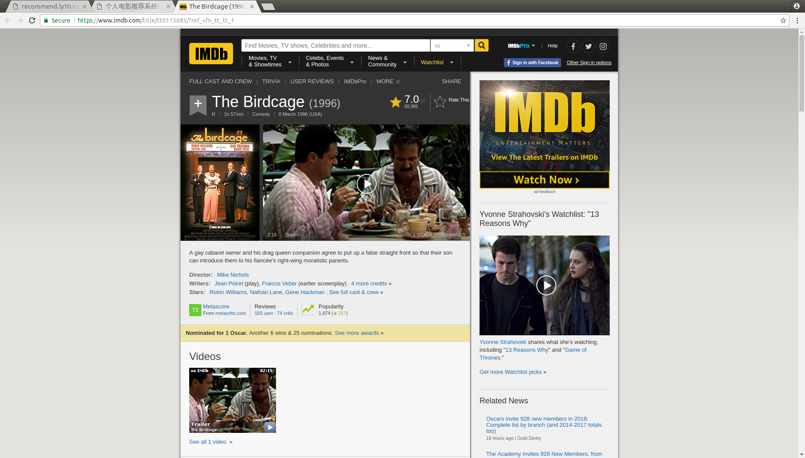
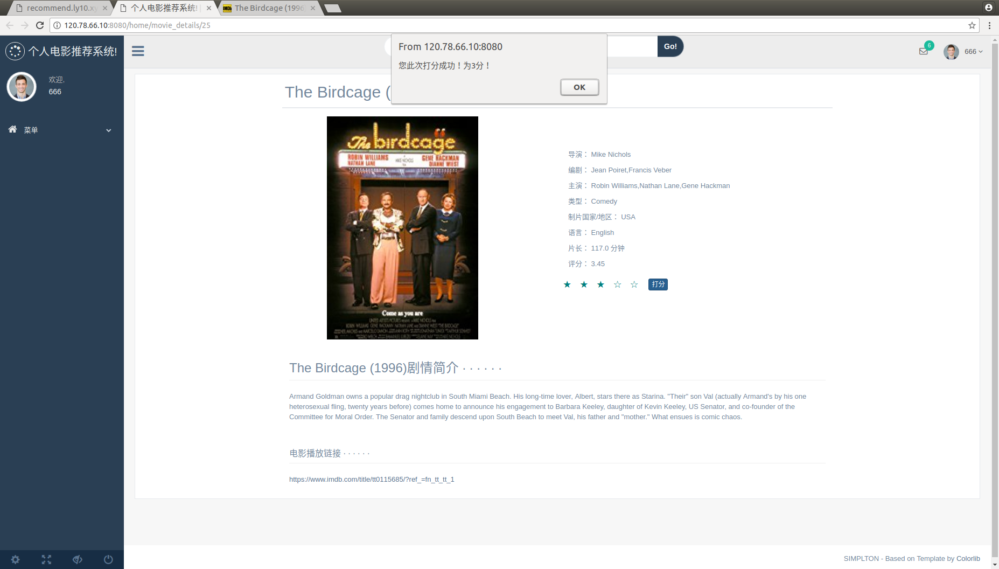

<h1>用户说明书</h1>

<h2>目录</h2>

* [1.用户注册](#1)
* [2.用户登入登出](#2)
* [3.系统功能](#3)
* [3.1推荐电影列表](#3.1)
* [3.2我已看过的电影列表](#3.2)
* [3.3电影详情](#3.3)

<h3 id='1'>1.用户注册</h3>

1.打开我们的系统网址: http://recommend.ly10.xyz

<h4>系统登录页:</h4>

2.新用户点击登录页的创建账号链接,进入账号注册页:

在注册页,新用户通过输入自己的用户名和密码, 点击"注册"按钮,完成注册.

注册完成后的提示如下图所示, 会提醒用户刚刚注册所使用的用户名和密码, 还有登录页的链接, 用户完成注册后, 可以使用注册的用户名和密码去登录系统:

该系统, 不支持重名用户, 所以在注册时, 如果用户使用的用户名已经存在的话, 当点击注册按钮后, 会有如下图提示, 用户此时可以点击下方的链接进入登录页后, 点击登录页下面的注册链接选择另一个用户名, 重新进行注册:

<h3 id='2'>2.用户登入登出</h3>

已有账号的用户,可以在登录页输入用户名和密码后, 点击登录按钮完成登录, 登录成功后, 来到系统的首页, 如下图所示:

当用户名或者密码错误时, 系统会有如下图提示, 提示用户名或者密码错误, 进行重新登录:

用户可以通过点击系统右上角的个人中心, 然后点击"Log out",随后即可退出该系统.

<h3 id='3'>3.系统功能</h3>

用户登录进来, 可以看到系统左侧的菜单栏和右侧的内容部分.菜单栏分为"推荐给我的电影"和"我已经看过的电影"两个部分.

<h4 id='3.1'>3.1推荐的电影列表</h4>
对于新用户登录进来, 看到的就是推荐给用户的最经典的电影列表.

而对于老用户,看到的就是依据用户对已看过的电影的打分记录来推荐给用户的, 用户可能感兴趣的电影列表. 本系统初始化的用户1-943, 都可以看到不同的推荐的电影.

电影列表展示电影的名称, 年份, 海报和平均评分信息. 没有海报的电影展示的是默认的海报图片.每页显示50条电影信息, 在列表最右下角设置有翻页功能, 用户可以通过点击"页码"或者是"上一页" "下一页"来进行页面跳转, 已查看不同页的电影信息.

<h4 id='3.2'>3.2我已看过的电影列表</h4>

已看过的电影列表, 展示的是用户打过分数的电影. 本系统初始化的用户1-943, 都可以看到已看过的电影列表.

电影列表展示电影的名称, 年份, 海报和平均评分信息. 没有海报的电影展示的是默认的海报图片. 每页显示50条电影信息, 在列表最右下角设置有翻页功能, 用户可以通过点击"页码"或者是"上一页" "下一页"来进行页面跳转, 已查看不同页的电影信息.

对于新注册的用户,  一开始的已看过的电影列表是空的, 如下图所示,.只有当用户给已看过的电影打过分数后, 就可以在已看过的电影列表中看到打过分的电影. 

*[但是目前该功能还未实现, 所以新用户的已看过电影列表是空的]*

<h4 id='3.3'>3.3电影详情</h4>
用户可以通过点击推荐的电影列表或者是已看过的电影列表中的某个电影的海报, 即可进入该电影的详情页. 

在电影详情页, 用户可以看到电影的名称, 年份, 海报, 导演, 编剧, 主演, 电影类, 制片国家/地区, 语言, 片长, 平均评分(最高分5分)等信息, 以及打分的部分. 还有电影的剧情简介以及电影播放链接.

通过点击电影播放链接, 可以跳转到该电影的播放页面.

用户可以通过点击几颗星, 来给当前电影打分. 一颗星代表1分, 最多5分. 例如用户要打3分, 则点击第三颗星星, 然后, 点击打分按钮, 完成打分. 系统会提示用户给当前电影打了多少分. 点击"ok"按钮后, 可关闭提示窗口.

*[打分的功能, 目前只实现了前端的响应, 提示用户给当前电影打了多少分.]*

